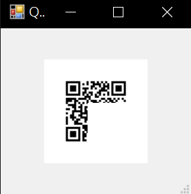

# ReadMe

Read this in other languages: [English](ReadMe.md), [中文](ReadMe_zh.md)

## Introduction

- Why ngrok ?
    - Need exposing local web server to the internet temporary for some development scenarios. 
    - Need to test web page on mobile.
- Why ZXing.Net ?
    - On the free plan, ngrok's URLs are randomly generated and temporary.
    - Scan QR code and redirect to testing page without edit url on mobile.
    - Development scenarios are on Windows.

## Dependencies

- ngrok
- ZXing.Net

## Prerequisites

### Install ngrok

1. Download ngrok
    https://ngrok.com/download
2. Unzip
    ```bash
    $ unzip /path/to/ngrok.zip
    ```
3. Connect account
    ```bash
    $ ./ngrok authtoken <your_auth_token>
    Authtoken saved to configuration file: ngrok.yml
    ```

### Install ZXing.Net

1. Download ZXing.Net
    https://github.com/micjahn/ZXing.Net/releases
2. Unzip and copy the DLL file of the corresponding platform
    ```bash
    $ unzip /path/to/ZXing.Net.zip
    $ cp /path/to/ZXing.Net/platform/zxing.dll /target/path/to/zxing.dll
    ```
    **\*Only tested the net4.8 platform**

## Usage

### Edit 'ZxingFolder' and 'NgrokFolder' variables

Edit `StartNgrok.ps1`, change `$ZxingFolder` and `$NgrokFolder` folder path.

### Run script

```powershell
.\StartNgrok.ps1 [port]
```

### Demo

- local server
    ```bash
    $ python3 -m http.server 8888
    ```
- ngrok tools
    ```bash
    $ .\StartNgrok.ps1 8888
    port: 8080
    ngrok started.
    ngrok url: https://some-random-url.ngrok.io
    ```
- QR code window
    