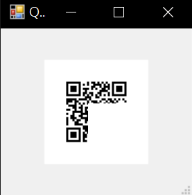

# ReadMe

其他語言版本: [English](ReadMe.md), [中文](ReadMe_zh.md)

## 介紹

- 為什麼使用 ngrok ?
    - 需要將本地端的網頁暫時放到外網上
    - 需要測試網頁在手機上的效果
- 為什麼使用 ZXing.Net ?
    - ngrok 的免費方案中，URL 是隨機產生的
    - 掃描 QR code 並重新導向測試頁面 
    - 開發環境在 Windows 上

## 相依

- ngrok
- ZXing.Net

## 準備

### 安裝 ngrok

1. 下載 ngrok
    https://ngrok.com/download
2. 解壓縮
    ```bash
    $ unzip /path/to/ngrok.zip
    ```
3. 連接 ngrok 帳號
    ```bash
    $ ./ngrok authtoken <your_auth_token>
    Authtoken saved to configuration file: ngrok.yml
    ```

### 安裝 ZXing.Net

1. 下載 ZXing.Net
    https://github.com/micjahn/ZXing.Net/releases
2. 解壓縮並複製對應的 DLL 檔案
    ```bash
    $ unzip /path/to/ZXing.Net.zip
    $ cp /path/to/ZXing.Net/platform/zxing.dll /target/path/to/zxing.dll
    ```
    **\*只測試過 net4.8 平台**

## 使用

### 設定 'ZxingFolder' 和 'NgrokFolder' 變數

編輯 `StartNgrok.ps1` 檔案，並設定 `$ZxingFolder` 及 `$NgrokFolder` 這兩個資料夾變數

### 執行

```powershell
.\StartNgrok.ps1 [port]
```

### 展示

- local server
    ```bash
    $ python3 -m http.server 8888
    ```
- ngrok tools
    ```bash
    $ .\StartNgrok.ps1 8888
    port: 8080
    ngrok started.
    ngrok url: https://some-random-url.ngrok.io
    ```
- QR code window
    